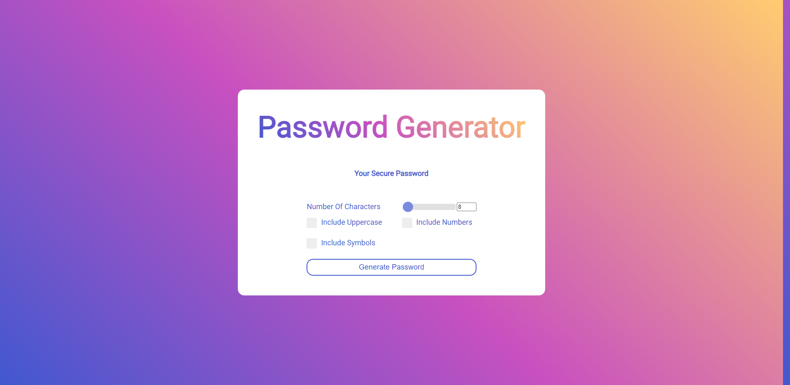

# JavaScript Password Generator

## Description 

This is a simple password generator tool built with HTML, CSS, and vanilla JavaScript.



Refer to [https://github.com/piersky1/javascript-password-generator/commits/main](https://github.com/piersky1/javascript-password-generator/commits/main) for a log of all commits.

This project was deployed using GitHub Pages and can be found here: [https://piersky1.github.io/javascript-password-generator/](https://piersky1.github.io/javascript-password-generator/)

### Disclaimer

The passwords are generated in your browser using JavaScript client-side. No data is sent to or received server.

Please note that this app uses the JavaScript ```Math.random()``` function, meaning the passwords generated by this tool are NOT cryptographically secure. Learn more about this on [StackOverflow](http://stackoverflow.com/questions/5651789/is-math-random-cryptographically-secure).

I, as the developer, am in no way responsible for any damages (data breaches, etc.) that occur to any users as a result of using this tool. This tool is intended for educational use only. This app is not intended for real-world application. Any password from this app is to be used at the user's own risk.

## Table of Contents


* [Installation](#installation)
* [Usage](#usage)
* [Credits](#credits)
* [License](#license)


## Installation

There are several options to "install" this project yourself:

* Download and view project on your machine locally.

* View the live, deployed application on the web at: [https://piersky1.github.io/javascript-password-generator/](https://piersky1.github.io/javascript-password-generator/)


## Usage 

This project is intended for educational purposes only.


## Credits

References:

* [Build A Password Generator With JavaScript - Tutorial](https://www.youtube.com/watch?v=iKo9pDKKHnc)

## License

MIT License

Copyright (c) [2020] [Pierce Brelinsky]

Permission is hereby granted, free of charge, to any person obtaining a copy
of this software and associated documentation files (the "Software"), to deal
in the Software without restriction, including without limitation the rights
to use, copy, modify, merge, publish, distribute, sublicense, and/or sell
copies of the Software, and to permit persons to whom the Software is
furnished to do so, subject to the following conditions:

The above copyright notice and this permission notice shall be included in all
copies or substantial portions of the Software.

THE SOFTWARE IS PROVIDED "AS IS", WITHOUT WARRANTY OF ANY KIND, EXPRESS OR
IMPLIED, INCLUDING BUT NOT LIMITED TO THE WARRANTIES OF MERCHANTABILITY,
FITNESS FOR A PARTICULAR PURPOSE AND NONINFRINGEMENT. IN NO EVENT SHALL THE
AUTHORS OR COPYRIGHT HOLDERS BE LIABLE FOR ANY CLAIM, DAMAGES OR OTHER
LIABILITY, WHETHER IN AN ACTION OF CONTRACT, TORT OR OTHERWISE, ARISING FROM,
OUT OF OR IN CONNECTION WITH THE SOFTWARE OR THE USE OR OTHER DEALINGS IN THE
SOFTWARE.


---


## Badges


---

This project was part of my coursework at the UNC Chapel Hill Coding Bootcamp. Full assigment details can be found [here](https://unc.bootcampcontent.com/UNC-Coding-Boot-Camp/unc-ral-fsf-pt-11-2020-u-c/blob/master/01-html-git-css/homework/README.md).
